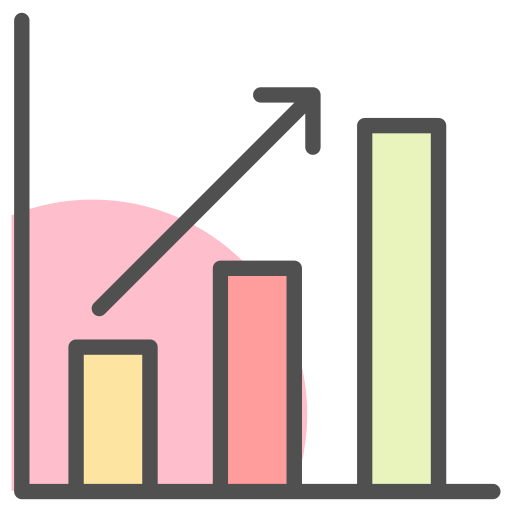
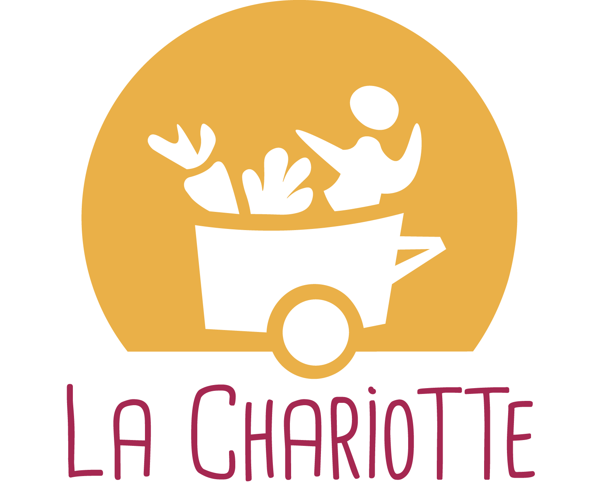

# Welcome to my academic GitHub !

-  I'm Pauline, a data scientist who likes exploring the vast world of data and IT. This repository serves as a showcase of my academic projects.
-  I am also a volunteer at the 'La Chariotte' association, which maintains a website who facilitate de group order management. If you'd like to take a look at the code, you can find it [here](https://gitlab.com/la-chariotte/la_chariotte)
-  Let's connect on [LinkedIn](https://www.linkedin.com/in/pauline-attal/)

